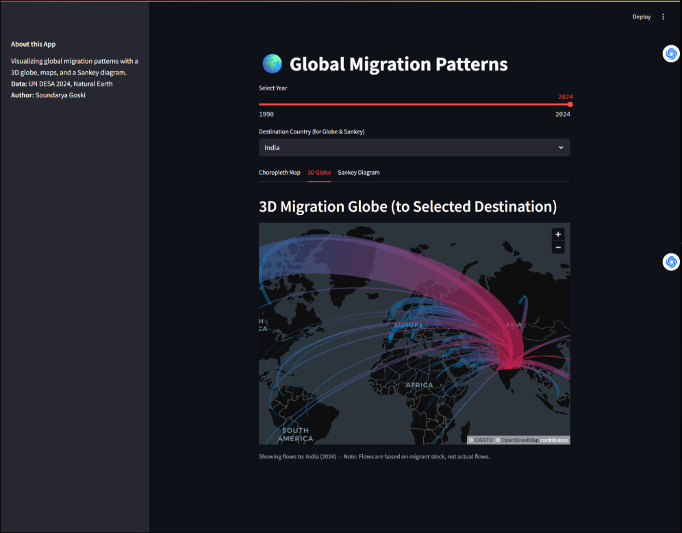
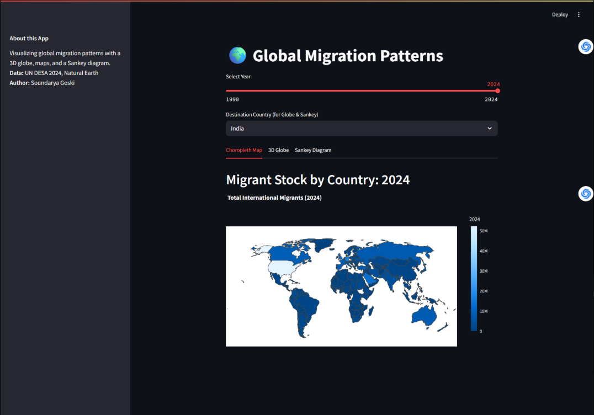
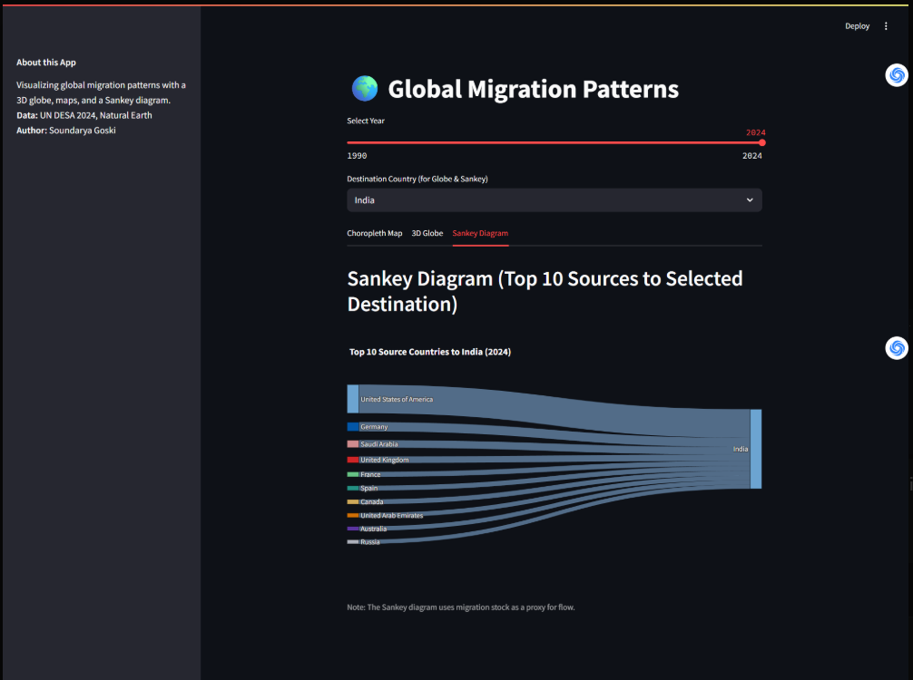

# 🌍 Global Migration Patterns Visualization

## Overview

**Global Migration Patterns** is an interactive data visualization dashboard built with Python and Streamlit.  
It explores international migration using a 3D globe, choropleth maps, and Sankey diagrams, powered by UN DESA 2024 data.

- **3D Globe:** Visualizes migration flows to selected destination countries.
- **Choropleth Map:** Shows the total migrant stock for every country, with an animated year slider.
- **Sankey Diagram:** Displays top source countries for each selected destination.
- **Fully interactive and fast!**

---

## 🚀 Demo Screenshots

### 3D Globe Migration Flows


### Choropleth Map


### Sankey Diagram


---

## 📈 Features

- Select year and destination country
- Dynamic 3D globe using Pydeck
- Beautiful choropleth maps and Sankey flows (Plotly)
- Clean, modern Streamlit interface
- Easy to extend or deploy

---

## 💾 Data Sources

- [UN DESA International Migrant Stock 2024](https://www.un.org/development/desa/pd/content/international-migrant-stock)
- [Natural Earth Shapefiles](https://www.naturalearthdata.com/)

---

## 🖥️ Run Locally

```bash
git clone https://github.com/your-username/global-migration-vis.git
cd global-migration-vis
pip install -r requirements.txt
streamlit run main_migration_vis.py
